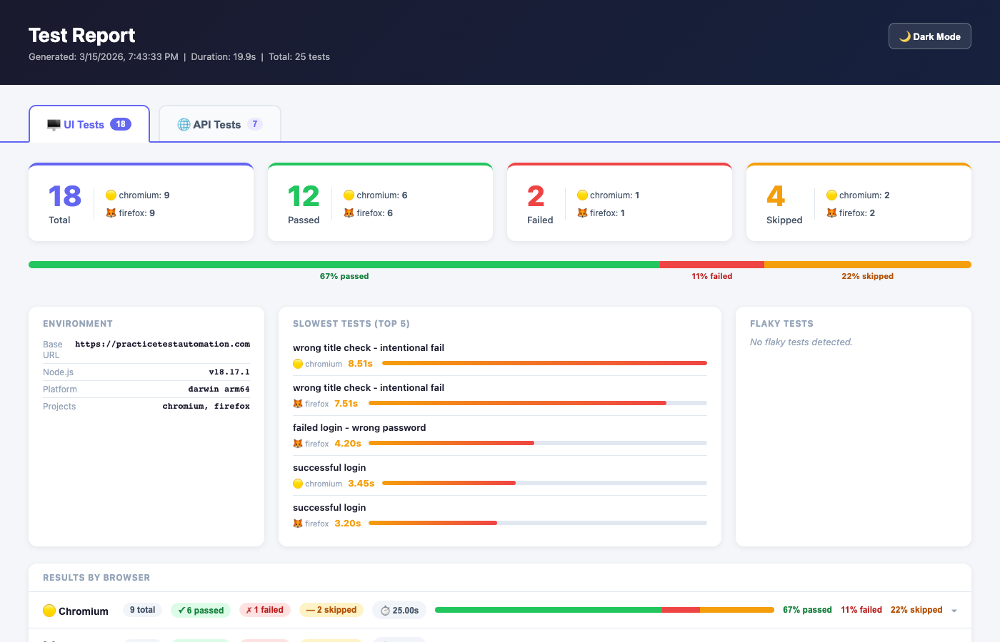
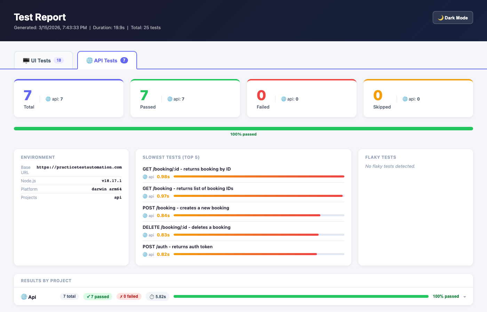

# Playwright TypeScript Test Automation Framework

A UI & API test automation framework built with Playwright and TypeScript. Implements the Page Object Model for UI tests and an API client layer for REST API tests, with a fully custom HTML reporter featuring separate UI and API sections.

---

## Tech Stack

| Tool | Version |
|---|---|
| Playwright | 1.58.2 |
| TypeScript | 5.9.3 |
| Node.js | 18+ |
| dotenv | 17.3.1 |

---

## Project Structure

```
pwright-typescript/
├── src/
│   ├── api/
│   │   └── BookingClient.ts         # Restful Booker API client
│   ├── fixtures/
│   │   └── baseTest.ts              # Custom test fixtures (loginPage, homePage)
│   ├── pages/
│   │   ├── LoginPage.ts             # Login page object
│   │   └── HomePage.ts              # Home page object
│   ├── data/
│   │   ├── users.ts                 # UI test user data
│   │   └── bookingData.ts           # API test booking payload factory
│   ├── reporter/
│   │   └── customHtmlReporter.ts    # Custom HTML reporter
│   └── utils/
│       └── env.ts                   # Environment variable helpers
├── tests/
│   ├── ui/
│   │   ├── login.spec.ts            # Login UI tests
│   │   └── homepage.spec.ts         # Homepage UI tests
│   └── api/
│       └── booking.spec.ts          # Restful Booker API tests
├── custom-report/                   # Generated HTML reports (gitignored)
├── .env                             # Environment variables (gitignored)
├── playwright.config.ts             # Playwright configuration
└── tsconfig.json                    # TypeScript configuration
```

---

## Setup

```bash
npm install
npx playwright install
```

Create a `.env` file in the project root:

```env
BASE_URL=https://practicetestautomation.com
USERNAME=your_username
PASSWORD=your_password
```

---

## Running Tests

```bash
# Run all tests (UI + API, headless)
npm test

# Run only UI tests
npx playwright test --project=chromium --project=firefox

# Run only API tests
npx playwright test --project=api

# Run with browser UI visible
npm run test:headed

# Run only in Chrome
npm run test:chrome

# Type check without running tests
npm run type-check
```

---

## Browsers

UI tests run on **Chromium** and **Firefox** by default. **WebKit** is conditionally included — it is skipped on Apple Silicon (M1/M2) running macOS Monterey or earlier due to Playwright compatibility.

API tests run as a dedicated `api` project with no browser overhead.

---

## Custom HTML Reporter

The report is divided into **UI Tests** and **API Tests** tabs — each with its own summary cards, progress bar, slowest tests, and test result breakdown.

### UI Tests Report



### API Tests Report



Each test run generates a self-contained HTML report in `custom-report/` with a timestamp in the filename (e.g. `index-2026-03-15_14-30-00.html`). Reports are never overwritten.

### Report Features

- Separate UI and API tabs with independent stats
- Summary cards with per-browser/project pass/fail/skip counts
- Progress bar with percentage labels
- Environment info (base URL, Node.js version, platform, projects)
- Slowest tests (top 5) with relative time bars
- Flaky test detection (retried tests that eventually passed)
- Results by browser/project with per-spec breakdown
- Per-browser tabs with search/filter, Expand All, Collapse All, Jump to Failure
- Collapsible suite → status group → test card hierarchy
- Failed suites auto-expand on load
- Error details with copy button and stack trace
- Failure screenshots embedded as base64
- Step-by-step execution log
- Dark mode toggle

To open the latest report:

```bash
npm run report
```

---

## Page Objects

### LoginPage (`src/pages/LoginPage.ts`)

| Method | Description |
|---|---|
| `goto()` | Navigate to `/practice-test-login/` |
| `login(username, password)` | Fill credentials and submit |
| `verifyLoginSuccess()` | Assert success message is visible |
| `verifyLoginFailure(message)` | Assert error message text |

### HomePage (`src/pages/HomePage.ts`)

| Method | Description |
|---|---|
| `goto()` | Navigate to `/` |
| `verifyHeadingVisible()` | Assert h1 is visible |
| `verifyTitle(expected)` | Assert page title |
| `verifyNavLinksExist()` | Assert navigation links exist |
| `verifyPracticeLinkVisible()` | Assert practice link is visible |

---

## API Client

API tests target [Restful Booker](https://restful-booker.herokuapp.com) and cover full CRUD operations.

### BookingClient (`src/api/BookingClient.ts`)

| Method | Description |
|---|---|
| `getToken()` | Authenticate and return auth token |
| `getAllBookingIds()` | Get list of all booking IDs |
| `getBooking(id)` | Get a booking by ID |
| `createBooking(booking)` | Create a new booking |
| `updateBooking(id, booking, token)` | Fully update a booking |
| `partialUpdateBooking(id, data, token)` | Partially update a booking |
| `deleteBooking(id, token)` | Delete a booking |

---

## Adding New Tests

### UI Test

1. Create a page object in `src/pages/`
2. Register it as a fixture in `src/fixtures/baseTest.ts`
3. Write your spec in `tests/ui/`

```ts
// tests/ui/example.spec.ts
import { test, expect } from '../../src/fixtures/baseTest';

test('my test', async ({ loginPage }) => {
  // ...
});
```

### API Test

1. Add methods to `BookingClient` or create a new client in `src/api/`
2. Write your spec in `tests/api/`

```ts
// tests/api/example.spec.ts
import { test, expect } from '@playwright/test';
import { BookingClient } from '../../src/api/BookingClient';

test('my api test', async ({ request }) => {
  const client = new BookingClient(request);
  // ...
});
```

---

## CI/CD

A GitHub Actions workflow (`.github/workflows/playwright.yml`) is included for running tests on push/pull request.
